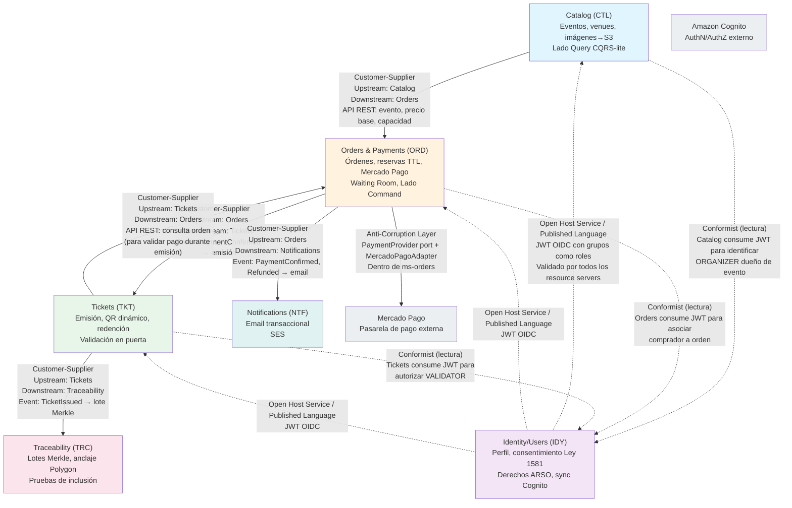

# Context Map — CriptoPass

| Campo | Valor |
|---|---|
| **Status** | `active` |
| **Proyecto** | CriptoPass (greenfield) |
| **Versión** | V1 |
| **Creado por** | enterprise-architect |
| **Fecha** | 2026-08-11 |

---

## 1. Bounded Contexts

### 1.1 Resumen

| Bounded Context | Código | Owner funcional | Owner técnico | Tipo de deployment | Fuente de verdad principal |
|---|---|---|---|---|---|
| **Catalog** | CTL | Product/Content | Backend Team | ECS Fargate (ms-catalog) | `catalog_db` (PostgreSQL) |
| **Orders & Payments** | ORD | Commerce | Backend Team | ECS Fargate (ms-orders) | `orders_db` (PostgreSQL) |
| **Tickets** | TKT | Ticketing | Backend Team | ECS Fargate (ms-tickets) | `tickets_db` (PostgreSQL) |
| **Identity/Users** | IDY | Identity/Compliance | Backend Team | ECS Fargate (ms-users) | `users_db` (PostgreSQL) |
| **Traceability** | TRC | Blockchain/Traceability | Backend Team | Lambda Go (fn-blockchain-anchor) | `traceability` (DynamoDB) |
| **Notifications** | NTF | Communications | Backend Team | Lambda Go (fn-notifications) | Sin estado (stateless); usa SES |

### 1.2 Contextos y Lenguaje Ubicuo

#### Catalog (CTL)
**Propósito:** Gestión y exposición del catálogo de eventos. Lado Query de CQRS-lite (lecturas públicas masivas y cacheables). Publicación de eventos, carga de imágenes a S3.

**Lenguaje Ubicuo:**
- **Evento**: unidad central del catálogo. Tiene nombre, descripción, fechas, lugar, capacidad, precios, imágenes, organizador dueño, estado.
- **Publicación**: acto de hacer visible un evento en el catálogo público. Cambio de estado `borrador → publicado`.
- **Capacidad**: número total de entradas disponibles para un tipo de boleta en un evento. No es inventario en tiempo real (eso es de Orders).
- **Precio Base**: precio de lista definido por el organizador. No incluye fee (el fee es de Orders).
- **Estado del Evento**: `borrador`, `publicado`, `agotado`, `cancelado`, `reprogramado`.
- **Venue/Lugar**: ubicación física del evento. Datos informativos.
- **Imagen del Evento**: recurso almacenado en S3, referenciado por URL. Catalog gestiona upload vía presigned URL.

**Términos que NO deben reutilizarse fuera de Catalog:**
- "Capacidad" (en Orders significa "inventario disponible en tiempo real", no la capacidad total configurada)
- "Precio" (en Orders es "precio final con fee", en Catalog es "precio base")
- "Estado" de evento (en Tickets los estados son de boleta, no de evento)

---

#### Orders & Payments (ORD)
**Propósito:** Ciclo completo de compra: órdenes, reservas de inventario con TTL, checkout, procesamiento de pagos vía Mercado Pago, webhooks, liquidación básica al organizador y sala de espera virtual. Lado Command de CQRS-lite.

**Lenguaje Ubicuo:**
- **Orden**: contenedor de la intención de compra. Tiene comprador, evento, N boletas solicitadas, estado, monto total, referencia de pago, TTL.
- **Reserva**: bloqueo temporal de inventario con TTL. Garantiza que las boletas solicitadas no se vendan a otro mientras el comprador paga. Estado volátil (Redis).
- **TTL (Time-To-Live)**: ventana de tiempo (ej. 10-15 minutos) durante la cual la reserva es válida. Al expirar, el inventario se libera automáticamente.
- **Checkout**: flujo que redirige al comprador a Mercado Pago para completar el pago.
- **Pago**: referencia externa de Mercado Pago. Tiene estado (pendiente/aprobado/rechazado/reembolsado), monto y moneda (COP en V1).
- **Webhook IPN**: notificación asíncrona de Mercado Pago sobre cambio de estado de un pago. Debe ser idempotente (por `payment_id`).
- **Fee**: cargo por servicio visible en el checkout. Asumido por el comprador (supuesto S-05). El fee + precio base = monto total.
- **Liquidación**: cálculo de lo que le corresponde al organizador por sus ventas (monto total − fee). V1: vista básica de ventas; la transferencia real es manual por ahora.
- **Sala de Espera**: cola FIFO virtual para ventas pico. Cada evento con alta demanda activa su propia cola en Redis. Control de admisión basado en inventario disponible.
- **Posición en Fila**: número estimado de usuarios delante del comprador en la sala de espera.
- **Admisión**: acto de permitir a un comprador salir de la sala de espera e iniciar el flujo de compra.
- **Reembolso**: devolución del dinero al comprador vía Mercado Pago. V1: solo vía SUPPORT (supuesto S-06). También automático en compensación de saga (EC-01, EC-03).

**Términos que NO deben reutilizarse fuera de Orders:**
- "Reserva" (en Tickets no existe; una boleta se "emite", no se "reserva")
- "TTL" (en Catalog/Redis cache es TTL de cache, no de inventario)
- "Liquidación" (específico del flujo financiero del organizador)
- "Fee" (Catalog desconoce el fee; solo conoce precio base)

---

#### Tickets (TKT)
**Propósito:** Emisión, gestión del ciclo de vida y validación de boletas. Hash criptográfico por boleta, QR dinámico rotativo firmado, redención única atómica en puerta. API de validación sync de latencia crítica.

**Lenguaje Ubicuo:**
- **Boleta**: entidad que representa el derecho de acceso a un evento. Tiene código único, hash criptográfico, estado (emitida/usada/anulada), timestamp de emisión, timestamp de uso, QR dinámico.
- **Emisión**: acto de crear boletas en respuesta a un pago confirmado. La saga de compra (Step Functions) invoca la API de emisión de ms-tickets.
- **Hash Criptográfico**: SHA-256 del código único + salt por boleta. Prueba criptográfica de emisión. No contiene datos personales del comprador.
- **QR Dinámico Rotativo**: código QR que se regenera cada 15-30 segundos con firma criptográfica HMAC temporal. Incluye: código de boleta, timestamp de generación, nonce, firma. Mitiga screenshot abuse.
- **Firma (HMAC)**: firma del payload del QR usando clave secreta del servidor. El validador verifica firma + vigencia temporal.
- **Rotación**: intervalo de refresco del QR (15-30s). El QR anterior expira al generarse uno nuevo.
- **Redención**: acto de marcar una boleta como usada en puerta. Atómica: una boleta solo se redime una vez. Ejecutada por VALIDATOR o SUPER_ADMIN.
- **Validación**: verificación sync del QR presentado: firma válida + dentro de ventana de rotación + boleta no usada previamente + evento activo.
- **Código de Boleta**: identificador único alfanumérico. Visible como fallback de entrada manual (sin cámara).
- **Ventana de Rotación**: período de validez de una instancia del QR (~30s, con tolerancia de ±5s por desync de reloj).
- **Prueba de Inclusión**: camino desde el hash de la boleta hasta la raíz Merkle. Almacenado tras el anclaje (proporcionado por Traceability).

**Términos que NO deben reutilizarse fuera de Tickets:**
- "Emisión" (Orders solo conoce "pago confirmado"; la emisión es downstream)
- "Redención" (Orders no redime; Orders solo ve el estado de la orden)
- "QR" y "Rotación" (específicos del mecanismo de validación en puerta)
- "Hash" (Catalog no conoce hashes; eso es de Tickets y Traceability)

---

#### Identity/Users (IDY)
**Propósito:** Perfil extendido de usuario, consentimiento de tratamiento de datos (Ley 1581 de 2012), ejercicio de derechos ARSO (acceso, rectificación, supresión, oposición). Sincronización con Cognito para atributos de perfil.

**Lenguaje Ubicuo:**
- **Usuario**: perfil completo del usuario en el sistema. Datos: nombre, correo, teléfono, documento de identidad (condicional a DIAN, Q-CR-05/Q-NC-04), consentimiento Habeas Data.
- **Perfil**: subconjunto de datos personales que el usuario puede ver y editar.
- **Consentimiento**: aceptación explícita del tratamiento de datos personales (Ley 1581) al momento del registro. Booleano con timestamp.
- **Derechos ARSO**: Acceso, Rectificación, Supresión, Oposición. Flujos funcionales que el usuario puede ejercer (no solo texto legal).
- **Rol**: grupo de Cognito asociado al usuario. V1: BUYER, SUPER_ADMIN, ORGANIZER, VALIDATOR, SUPPORT.
- **Sincronización Cognito**: ms-users puede leer atributos del perfil Cognito (nombre, email) y escribir atributos custom (documento de identidad, teléfono, consentimiento). No gestiona credenciales (eso es Cognito nativo).
- **Registro**: flujo de creación de cuenta vía Cognito Hosted UI. ms-users recibe evento post-registro para crear el perfil interno.

**Términos que NO deben reutilizarse fuera de Identity:**
- "Consentimiento" (es un término legal de Habeas Data, no aplica a otras funcionalidades)
- "ARSO" (acrónimo regulatorio colombiano)
- "Usuario" en Identity es el perfil completo con PII; en otros contextos es solo una referencia (`sub` del JWT)

---

#### Traceability (TRC)
**Propósito:** Construcción periódica de árboles Merkle con los hashes de boletas emitidas, anclaje de la raíz en Polygon L2, almacenamiento de pruebas de inclusión y metadata para verificación pública. Diseño compatible con futura tokenización NFT.

**Lenguaje Ubicuo:**
- **Lote Merkle (Batch)**: agrupación de hashes de boletas emitidas en un período. Tiene ID, timestamp de inicio/fin, estado (pendiente/anclado/fallido).
- **Raíz Merkle (Merkle Root)**: hash raíz del árbol Merkle construido con todos los hashes del lote. Es el único dato que se ancla on-chain.
- **Hash de Boleta**: SHA-256 del código único de la boleta + salt. Proporcionado por Tickets al emitir. Es la hoja del árbol Merkle.
- **Anclaje (Anchor)**: transacción en Polygon L2 que almacena la raíz Merkle en un smart contract. Incluye: raíz Merkle, timestamp del lote, nonce. Costo mínimo (~fracción de centavo).
- **Prueba de Inclusión (Merkle Proof)**: camino de hashes desde una hoja (hash de boleta) hasta la raíz. Permite verificar que una boleta pertenece a un lote anclado sin revelar las demás.
- **Transacción Polygon (tx hash)**: hash de la transacción on-chain donde se ancló la raíz Merkle. Referencia para verificación pública vía PolygonScan.
- **Verificación Pública**: consulta pública (sin login) que recibe un código de boleta, reconstruye el hash, verifica la prueba de inclusión contra la raíz anclada en Polygon.

**Términos que NO deben reutilizarse fuera de Traceability:**
- "Anclaje" y "Lote" (específicos del proceso blockchain)
- "Raíz Merkle" (concepto criptográfico; Tickets solo maneja hashes individuales)
- "Prueba de Inclusión" (específica del árbol Merkle; Tickets no necesita este concepto)

---

#### Notifications (NTF)
**Propósito:** Envío de comunicaciones transaccionales a compradores y administradores. V1: solo email vía Amazon SES. Sin estado propio; consume eventos de dominio y envía mensajes.

**Lenguaje Ubicuo:**
- **Notificación**: mensaje transaccional enviado a un usuario. Tiene tipo, destinatario, plantilla, datos de contexto.
- **Plantilla**: diseño predefinido de email. Diferentes plantillas para: confirmación de compra, reenvío de boletas, cancelación de evento, reembolso, notificación de sala de espera.
- **Canal**: medio de envío. V1: solo email. V2+: SMS, push.
- **Destino**: email del destinatario extraído del perfil (vía JWT claims o datos del evento).
- **Confirmación**: email enviado tras pago exitoso con resumen de compra y enlace a "Mis boletas".
- **Reenvío**: email iniciado por SUPPORT para reenviar boletas a un comprador. Queda registrado en auditoría.

**Términos que NO deben reutilizarse fuera de Notifications:**
- "Plantilla" (es un concepto de rendering de email, no de negocio)
- "Canal" (SMS/push/email; en otros contextos "canal" podría significar otra cosa)

---

## 2. Context Map (Relaciones DDD)

### 2.1 Diagrama de Contextos

### 2.2 Relaciones Detalladas

#### CATALOG → ORDERS (Customer-Supplier)
| Aspecto | Detalle |
|---|---|
| **Upstream** | Catalog |
| **Downstream** | Orders |
| **Tipo DDD** | Customer-Supplier (Catalog lidera el contrato; Orders se adapta) |
| **Mecanismo** | Sync REST API. Orders consulta ms-catalog para obtener datos del evento durante el checkout (precio base, capacidad, estado) |
| **Datos transferidos** | event_id, nombre, precio_base, capacidad_total, estado (debe ser `publicado`), organizer_id |
| **Contrato** | OpenAPI spec de ms-catalog: `GET /api/v1/catalog/events/{eventId}` y `GET /api/v1/catalog/events/{eventId}/availability` |
| **Consistencia** | Eventual. Catalog es fuente de verdad del evento. Orders lee al iniciar checkout y asume que el dato es vigente. Si el evento se cancela durante el checkout, Orders maneja el edge case |
| **Fallback** | Si Catalog no responde, Orders rechaza el checkout con error 503 |

#### ORDERS → TICKETS (Customer-Supplier)
| Aspecto | Detalle |
|---|---|
| **Upstream** | Orders (inicia la emisión tras pago confirmado) |
| **Downstream** | Tickets |
| **Tipo DDD** | Customer-Supplier (Orders lidera el flujo; Tickets implementa la emisión) |
| **Mecanismo** | Paso de saga en Step Functions: pago confirmado → Step Functions invoca API de ms-tickets `POST /api/v1/tickets/issuance` con los datos de la orden. También async: Orders emite evento `PaymentConfirmed` a EventBridge |
| **Datos transferidos** | order_id, comprador (sub), event_id, cantidad, tipo_boleta, precio unitario |
| **Contrato** | OpenAPI spec de ms-tickets: `POST /api/v1/tickets/issuance`. Idempotencia por `order_id` (si la saga reintenta, ms-tickets no duplica boletas) |
| **Compensación** | Si la emisión falla, Step Functions ejecuta paso de compensación: `POST /api/v1/orders/{orderId}/refund` en ms-orders |

#### ORDERS → NOTIFICATIONS (Customer-Supplier)
| Aspecto | Detalle |
|---|---|
| **Upstream** | Orders (emite eventos de dominio) |
| **Downstream** | Notifications (reacciona enviando emails) |
| **Tipo DDD** | Customer-Supplier (Orders define los eventos; Notifications se adapta) |
| **Mecanismo** | Async event-driven vía EventBridge → SQS → Lambda. Eventos: `PaymentConfirmed`, `OrderRefunded`, `OrderCancelled` |
| **Datos transferidos** | order_id, comprador_email, event_name, boletas_cantidad, monto_total, motivo (si refund/cancel) |
| **Contrato** | EventBridge event schema. Formato JSON con versionado (`v1`) |
| **Consistencia** | Eventual. Notifications es stateless; si un email falla, SQS retry + DLQ |

#### TICKETS → TRACEABILITY (Customer-Supplier)
| Aspecto | Detalle |
|---|---|
| **Upstream** | Tickets (emite evento tras emitir boletas) |
| **Downstream** | Traceability (construye lote Merkle y ancla en Polygon) |
| **Tipo DDD** | Customer-Supplier (Tickets define el evento TicketIssued; Traceability lo consume) |
| **Mecanismo** | Async event-driven vía EventBridge → SQS → Lambda fn-blockchain-anchor. La lambda también se ejecuta programada (EventBridge Scheduler cada 5 min) como barrido para lotes |
| **Datos transferidos** | ticket_id, ticket_hash (SHA-256), event_id, timestamp_emision |
| **Contrato** | EventBridge event schema `TicketIssued`. La lambda acumula eventos en memoria o consulta tickets_db (réplica de lectura o API) para lotes programados |
| **Consistencia** | Eventual. Si el anclaje falla, reintentos con backoff. Las boletas son válidas internamente aunque el anclaje esté pendiente |

#### ORDERS ↔ MERCADO PAGO (Anti-Corruption Layer)
| Aspecto | Detalle |
|---|---|
| **Upstream** | Mercado Pago (sistema externo) |
| **Downstream** | Orders |
| **Tipo DDD** | Anti-Corruption Layer (ACL). El puerto `PaymentProvider` y el adaptador `MercadoPagoAdapter` traducen entre el modelo externo de MP y el modelo interno de Orders |
| **Ubicación ACL** | Dentro de `ms-orders`, en el adaptador secundario (infrastructure layer hexagonal) |
| **Mecanismo** | Sync REST para crear preferencia de pago + Webhook IPN para notificaciones de estado |
| **Modelos traducidos** | `MercadoPagoPayment` → `Payment` (interno), `MercadoPagoWebhookNotification` → `PaymentStatusChanged` |
| **Contrato** | Mercado Pago API (externo). Webhook handler en ms-orders validado con firma HMAC de Mercado Pago |

#### IDENTITY → TODOS LOS SERVICIOS (Open Host Service / Published Language)
| Aspecto | Detalle |
|---|---|
| **Upstream** | Amazon Cognito (Identity Provider) |
| **Downstream** | Catalog, Orders, Tickets, Users (todos los resource servers) |
| **Tipo DDD** | Published Language (JWT OIDC con claims estándar + custom `cognito:groups`). Cognito + ms-users como Open Host Service |
| **Mecanismo** | JWT en header `Authorization: Bearer <token>`. Cada resource server valida firma contra JWKS de Cognito, claims `iss`, `aud`, `exp`, `cognito:groups` |
| **Contrato** | OIDC standard + claim `cognito:groups` (array de strings: ["BUYER"] o ["ORGANIZER"] o ["SUPER_ADMIN"], etc.) |
| **Consistencia** | Fuerte (token firmado). TTL del token = 1 hora; refresh token para renovación |

---

## 3. Fuente de Verdad por Dato Crítico

| Dato | Fuente de verdad primaria | Réplicas/Lecturas en otros contextos | Consistencia |
|---|---|---|---|
| **Evento** (datos, precio base, capacidad total, estado) | `ms-catalog` → `catalog_db` | `ms-orders` lee al iniciar checkout (sync API) | Fuerte en Catalog; Eventual en Orders (ventana de cache ≤ 60s) |
| **Imagen del evento** | AWS S3 (bucket catalog-images) | Ninguna réplica. URL pública o presigned | Fuerte (S3 es fuente única) |
| **Orden** (estado, monto, comprador) | `ms-orders` → `orders_db` | `ms-tickets` consulta orden durante emisión (sync API) | Fuerte (transaccional en Orders) |
| **Pago** (estado, referencia MP) | `ms-orders` → `orders_db` + Mercado Pago (externo) | Ninguna réplica | Fuerte (Orders es dueño; MP es externo) |
| **Boleta** (estado, hash, QR) | `ms-tickets` → `tickets_db` | `fn-blockchain-anchor` consume eventos (async) para Merkle | Fuerte en Tickets; Eventual en Traceability (hasta 5 min para anclaje) |
| **Hash de boleta** | `ms-tickets` → `tickets_db` | `fn-blockchain-anchor` → `traceability` DynamoDB | Fuerte en Tickets; Eventual en Traceability |
| **Usuario** (perfil, consentimiento) | `ms-users` → `users_db` | Cognito User Pool (atributos custom) | Fuerte en Users; Sincronizado bidireccional con Cognito |
| **Roles de usuario** | Amazon Cognito User Pools (grupos) | Validado por todos los resource servers vía JWT | Fuerte (en token, TTL 1h) |
| **Lote Merkle** (raíz, tx hash) | `fn-blockchain-anchor` → `traceability` DynamoDB | Polygon L2 (on-chain, inmutable) | Fuerte en Polygon (inmutable); DynamoDB como cache |
| **Sala de espera** (cola, posición) | Redis (datos volátiles) | Ninguna réplica | Fuerte (en memoria, sin persistencia). Si Redis falla, la sala se reconstruye |

---

## 4. Notas y Supuestos

- **Waiting Room:** La sala de espera NO es un bounded context independiente. Forma parte de **Orders & Payments (ORD)** como un módulo interno con estado en Redis. Justificación: la cola de espera está intrínsecamente acoplada al estado de inventario; separarla como contexto propio introduciría acoplamiento cross-service en el hot path de compra sin beneficio de desacoplamiento real.
- **Ticket Issuance:** La emisión de boletas ocurre dentro del bounded context **Tickets (TKT)**. La saga de Step Functions invoca la API de ms-tickets. No se crea un bounded context "Ticket Issuance" separado porque la emisión ES la responsabilidad core de Tickets.
- **Cognito:** Aunque es un sistema externo, su configuración de roles/grupos y la sincronización de atributos con ms-users lo convierten en un Published Language compartido por todos los contextos. ms-users actúa como fachada (Open Host Service) para operaciones de perfil.
- **EventBridge:** No es un bounded context; es infraestructura de mensajería que implementa las relaciones Customer-Supplier asíncronas. Los contratos de eventos son propiedad del upstream (quien emite), no de EventBridge.
- **DynamoDB:** La base de datos de Traceability es DynamoDB (no PostgreSQL) por ajuste natural al patrón serverless de Lambda Go. Modelo de datos key-value simple (batch_id → metadata Merkle).
