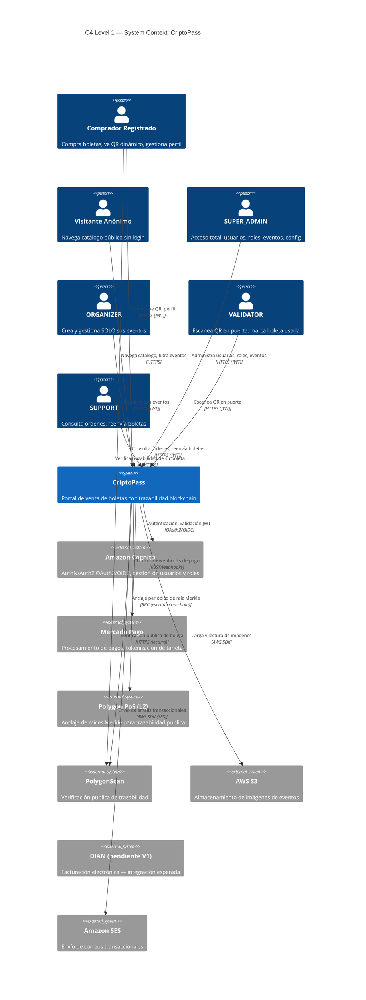

# System Landscape — CriptoPass

| Campo | Valor |
|---|---|
| **Status** | `active` |
| **Proyecto** | CriptoPass (greenfield) |
| **Versión** | V1 |
| **Creado por** | enterprise-architect |
| **Fecha** | 2026-08-11 |
| **Modelo de referencia** | C4 Model — Level 1 (System Context) + Level 2 (Containers) |

---

## 1. C4 Level 1 — System Context

### 1.1 Diagrama

### 1.2 Actores y Responsabilidades

| Actor | Tipo | Responsabilidad | Auth |
|---|---|---|---|
| **Visitante Anónimo** | Persona | Navegar catálogo, ver detalle de evento, buscar/filtrar | Ninguna |
| **Comprador Registrado** | Persona | Iniciar compra, pagar, ver "Mis boletas", abrir QR dinámico, gestionar perfil | Cognito JWT (grupo `BUYER`) |
| **SUPER_ADMIN** | Persona | Gestión total de usuarios, roles, organizadores, todos los eventos, todas las órdenes, configuración global | Cognito JWT (grupo `SUPER_ADMIN`) |
| **ORGANIZER** | Persona | CRUD de SUS eventos, carga de imágenes a S3, ver ventas de sus eventos, definir capacidad/precios/fechas | Cognito JWT (grupo `ORGANIZER`) |
| **VALIDATOR** | Persona | Validación/escaneo de QR en puerta (cámara web). Solo marca uso; no emite ni anula boletas | Cognito JWT (grupo `VALIDATOR`) |
| **SUPPORT** | Persona | Consulta de órdenes, reenvío de boletas, soporte a compradores. No edita eventos ni reembolsa | Cognito JWT (grupo `SUPPORT`) |

### 1.3 Sistemas Externos

| Sistema | Propósito | Dirección | Criticidad | Owner del contrato |
|---|---|---|---|---|
| **Amazon Cognito** | AuthN/AuthZ OAuth2/OIDC, User Pools con grupos como roles | Bidireccional (login + validación JWT) | **Crítica** — sin auth no opera el sistema | CriptoPass (configuración) / AWS (servicio) |
| **Mercado Pago** | Procesamiento de pagos, tokenización de tarjeta. Scope PCI delegado | Bidireccional (checkout redirect + webhooks IPN) | **Crítica** — sin pago no hay venta | Mercado Pago (API externa) / CriptoPass (webhook handler) |
| **Polygon PoS (L2)** | Anclaje de raíces Merkle. Escritura on-chain de bajo costo | Salida (escritura RPC) + Lectura pública (verificación) | **Alta** — diferenciador de producto | Polygon (protocolo) / CriptoPass (contrato de anclaje) |
| **PolygonScan** | Verificación pública de trazabilidad vía explorador | Lectura pública (HTTPS) | **Media** — UX de verificación | PolygonScan (plataforma) |
| **AWS S3** | Almacenamiento de imágenes de eventos (carga vía presigned URL) | Escritura (carga) + Lectura (serving) | **Alta** — sin imágenes no se publican eventos visualmente | CriptoPass (bucket policy) |
| **Amazon SES** | Envío de correos transaccionales (confirmación compra, reenvío boletas, notificaciones) | Salida (SMTP/API) | **Alta** — experiencia del comprador | AWS (servicio) / CriptoPass (dominio verificado) |
| **DIAN** | Facturación electrónica (tiquete POS electrónico) | **Pendiente de definición** (Q-CR-05) | **Media (V1)** — integración esperada pero no bloqueante bajo supuesto S-07 | DIAN (regulatorio) |

---

## 2. C4 Level 2 — Containers

### 2.1 Diagrama

```mermaid
C4Container
  title C4 Level 2 — Containers: CriptoPass

  Person(comprador, "Comprador", "Compra boletas")
  Person(admin_user, "Usuario Admin", "SUPER_ADMIN / ORGANIZER / VALIDATOR / SUPPORT")

  System_Ext(cognito, "Amazon Cognito", "OAuth2/OIDC, User Pools + Grupos")
  System_Ext(mercadopago, "Mercado Pago", "Checkout + Webhooks IPN")
  System_Ext(polygon, "Polygon PoS L2", "Anclaje on-chain")
  System_Ext(s3, "AWS S3", "Imágenes de eventos")
  System_Ext(ses, "Amazon SES", "Email transaccional")

  Container_Boundary(vercel, "Vercel") {
    Container(fr_portal, "Portal Compradores", "Next.js / React", "SPA + SSR para catálogo público SEO. Consume APIs vía ALB")
    Container(fr_admin, "Panel Admin", "Next.js / React", "SPA para gestión multi-rol. Cámara web para validación QR")
  }

  Container_Boundary(aws, "AWS Cloud") {
    Container(alb, "ALB", "Application Load Balancer", "TLS termination, routing a microservicios ECS. Health checks. Rate limiting vía WAF")
    Container(apigw, "API Gateway (opcional)", "", "Evaluado para futuras lambdas públicas. V1 usa ALB para todo el tráfico HTTP")
    System_Boundary(ecs, "ECS Fargate Cluster") {
      Container(ms_catalog, "ms-catalog", "Kotlin + Spring Boot", "Catálogo de eventos, venues, imágenes→S3. API pública de lectura (cacheable). Lado Query de CQRS-lite")
      Container(ms_orders, "ms-orders", "Kotlin + Spring Boot", "Órdenes, reservas TTL, checkout, PaymentProvider+MercadoPago, webhooks, Waiting Room (Redis). Saga orquestada por Step Functions")
      Container(ms_tickets, "ms-tickets", "Kotlin + Spring Boot", "Emisión post-pago, hash criptográfico, QR dinámico rotativo firmado, redención única atómica. API de validación en puerta (sync, latencia crítica)")
      Container(ms_users, "ms-users", "Kotlin + Spring Boot", "Perfil extendido, consentimiento Ley 1581, derechos ARSO. Sincronización con Cognito")
    }

    Container(stepfn, "Step Functions", "AWS Step Functions", "Orquesta la saga de compra: reserva→pago→emisión→compensación. Máquina de estados con retries y timeouts")

    Container(redis, "ElastiCache (Redis)", "Redis OSS", "Sala de espera (cola FIFO), reservas con TTL, cache de catálogo público")
    Container(db_catalog, "RDS PostgreSQL — catalog_db", "PostgreSQL 16", "Base de datos del bounded context Catalog")
    Container(db_orders, "RDS PostgreSQL — orders_db", "PostgreSQL 16", "Base de datos del bounded context Orders & Payments")
    Container(db_tickets, "RDS PostgreSQL — tickets_db", "PostgreSQL 16", "Base de datos del bounded context Tickets")
    Container(db_users, "RDS PostgreSQL — users_db", "PostgreSQL 16", "Base de datos del bounded context Identity/Users")
    ContainerDb(db_traceability, "DynamoDB — traceability", "DynamoDB", "Lotes Merkle, tx hash Polygon, pruebas de inclusión. Key-Value serverless")

    Container(lb_fn_notif, "fn-notifications", "Lambda Go", "Consume eventos de dominio vía EventBridge→SQS. Envía emails transaccionales vía SES")
    Container(lb_fn_anchor, "fn-blockchain-anchor", "Lambda Go", "Procesamiento programado (EventBridge Scheduler). Construye Merkle tree, ancla raíz en Polygon L2, guarda metadata en DynamoDB")

    Container(eventbridge, "EventBridge", "Event Bus", "Bus de eventos de dominio. Reglas de routing a SQS/Lambda/Step Functions")
    Container(sqs_notif, "SQS — notifications", "Queue (Standard)", "Buffer para eventos de notificación. Dead-letter queue configurada")
    Container(sqs_ticket, "SQS — ticket-events", "Queue (Standard)", "Buffer para eventos de emisión de boletas → anclaje Merkle")
  }

  Rel(fr_portal, alb, "API calls", "HTTPS (JWT para endpoints autenticados)")
  Rel(fr_admin, alb, "API calls", "HTTPS (JWT + roles)")
  Rel(alb, ms_catalog, "Route /api/v1/catalog/**", "HTTP (internal)")
  Rel(alb, ms_orders, "Route /api/v1/orders/**", "HTTP (internal)")
  Rel(alb, ms_tickets, "Route /api/v1/tickets/**", "HTTP (internal)")
  Rel(alb, ms_users, "Route /api/v1/users/**", "HTTP (internal)")

  Rel(ms_orders, mercadopago, "Checkout redirect + Webhooks IPN", "HTTPS (API Key Mercado Pago)")
  Rel(ms_orders, redis, "Waiting Room, Reservas TTL", "Redis Protocol")
  Rel(ms_catalog, redis, "Cache de catálogo", "Redis Protocol")
  Rel(ms_catalog, s3, "Presigned URLs (upload) / Lectura (serving)", "AWS SDK")
  Rel(ms_orders, eventbridge, "Emite: PaymentConfirmed, PaymentFailed, OrderCancelled", "EventBridge SDK")
  Rel(ms_tickets, eventbridge, "Emite: TicketIssued", "EventBridge SDK")
  Rel(eventbridge, sqs_notif, "Route eventos a cola de notificaciones", "SQS Target")
  Rel(eventbridge, sqs_ticket, "Route eventos de emisión", "SQS Target")
  Rel(sqs_notif, lb_fn_notif, "Consume mensajes", "SQS Polling")
  Rel(sqs_ticket, lb_fn_anchor, "Consume mensajes (batch)", "SQS Polling")
  Rel(lb_fn_notif, ses, "Envía emails", "AWS SDK (SES)")
  Rel(lb_fn_anchor, polygon, "Ancla raíz Merkle", "JSON-RPC")
  Rel(lb_fn_anchor, db_traceability, "Guarda metadata Merkle", "AWS SDK (DynamoDB)")

  Rel(stepfn, ms_tickets, "Llama API de emisión de boletas (vía ALB)", "HTTPS")
  Rel(stepfn, ms_orders, "Llama API de reembolso (compensación, vía ALB)", "HTTPS")
  Rel_Back(eventbridge, stepfn, "Dispara saga tras PaymentConfirmed", "EventBridge → Step Functions")
  Rel(ms_catalog, db_catalog, "rw", "JDBC")
  Rel(ms_orders, db_orders, "rw", "JDBC")
  Rel(ms_tickets, db_tickets, "rw", "JDBC")
  Rel(ms_users, db_users, "rw", "JDBC")

  Rel(fr_portal, cognito, "Login OAuth2/OIDC (PKCE)", "HTTPS")
  Rel(fr_admin, cognito, "Login OAuth2/OIDC (PKCE)", "HTTPS")
  Rel(ms_catalog, cognito, "Validación JWT (JWKS)", "HTTPS")
  Rel(ms_orders, cognito, "Validación JWT (JWKS)", "HTTPS")
  Rel(ms_tickets, cognito, "Validación JWT (JWKS)", "HTTPS")
  Rel(ms_users, cognito, "Validación JWT + Sincronización", "HTTPS (Admin API)")
```

### 2.2 Contenedores — Razón de Existir y Owner

| Contenedor | Stack | Razón de existir | Bounded Context | Owner funcional | Owner técnico |
|---|---|---|---|---|---|
| **Portal Compradores** (`fr-portal`) | Next.js (React), Vercel | Interfaz pública para compradores. SSR para SEO de catálogo. SPA para flujo autenticado | N/A (Frontend) | Product/UX | Frontend Team |
| **Panel Admin** (`fr-admin`) | Next.js (React), Vercel | Interfaz administrativa multi-rol: gestión eventos, validación QR, soporte | N/A (Frontend) | Product/UX | Frontend Team |
| **ALB** | AWS ALB | TLS termination, routing HTTP a microservicios ECS. Health checks. Base para futura adición de WAF y API Gateway | N/A (Infraestructura) | Platform/SRE | Infrastructure Team |
| **ms-catalog** | Kotlin + Spring Boot, ECS Fargate | Catálogo público de eventos (listado, detalle, búsqueda, filtros). Carga de imágenes a S3. Lado Query de CQRS-lite (lecturas cacheables) | **Catalog** | Product/Content | Backend Team |
| **ms-orders** | Kotlin + Spring Boot, ECS Fargate | Órdenes, reservas con TTL, checkout, puerto PaymentProvider + adaptador Mercado Pago, webhooks IPN, Waiting Room (Redis), liquidación básica al organizador. Lado Command de CQRS-lite | **Orders & Payments** | Commerce | Backend Team |
| **ms-tickets** | Kotlin + Spring Boot, ECS Fargate | Emisión de boletas post-pago, hash criptográfico por boleta, QR dinámico rotativo firmado (15-30s), redención única atómica. API de validación en puerta (sync, latencia crítica p95 < 500ms) | **Tickets** | Ticketing | Backend Team |
| **ms-users** | Kotlin + Spring Boot, ECS Fargate | Perfil extendido de usuario, consentimiento Ley 1581, ejercicio de derechos ARSO. Sincronización con Cognito (lectura/escritura de atributos) | **Identity/Users** | Identity/Compliance | Backend Team |
| **Step Functions** | AWS Step Functions | Orquesta la saga de compra con compensaciones: pago aprobado sin emisión → reembolso automático; TTL expirado con pago posterior → reembolso. Timeouts y retries por paso | N/A (Orquestación) | Commerce | Backend Team |
| **fn-notifications** | Lambda Go | Consume eventos de dominio (PaymentConfirmed, TicketIssued, OrderCancelled) vía EventBridge→SQS. Envía emails transaccionales vía SES con plantillas | **Notifications** | Communications | Backend Team |
| **fn-blockchain-anchor** | Lambda Go | Programado cada 5 min o batch de 500 boletas. Construye Merkle tree, calcula raíz, ancla en Polygon L2. Almacena metadata en DynamoDB. Reintentos con backoff ante fallo | **Traceability** | Blockchain/Traceability | Backend Team |
| **EventBridge** | AWS EventBridge | Bus de eventos central. Recibe eventos de dominio de microservicios y los rutea a colas SQS o dispara Step Functions. Reglas de enrutamiento por tipo de evento | N/A (Infraestructura) | Platform/SRE | Infrastructure Team |
| **ElastiCache (Redis)** | AWS ElastiCache for Redis | Tres propósitos: (1) cola FIFO de sala de espera por evento, (2) reservas de inventario con TTL, (3) cache de catálogo público. Datos volátiles, no fuente de verdad | N/A (Infraestructura compartida) | Platform/SRE | Infrastructure Team |
| **RDS PostgreSQL (×4)** | AWS RDS PostgreSQL 16 | Bases de datos independientes: `catalog_db`, `orders_db`, `tickets_db`, `users_db`. Una BD por microservicio, cero shared database. Flyway gestiona esquema, JPA en modo validate | Catalog, Orders, Tickets, Identity | Cada equipo dueño de su BD | Backend/Platform Team |
| **DynamoDB — traceability** | AWS DynamoDB | Almacena lotes Merkle: batch_id (PK), merkle_root, ticket_hashes[], polygon_tx_hash, status, timestamps. Serverless, sin management de conexiones desde Lambda | **Traceability** | Blockchain/Traceability | Backend Team |
| **Amazon Cognito (externo)** | AWS Cognito User Pools | AuthN/AuthZ OAuth2/OIDC. Roles como grupos (SUPER_ADMIN, ORGANIZER, VALIDATOR, SUPPORT, BUYER). JWT con claim `cognito:groups`. JWKS validado por todos los resource servers | N/A (Externo) | Identity/Security | Platform/SRE |

### 2.3 Flujos Críticos

| Flujo | Componentes involucrados | Modo | Latencia esperada |
|---|---|---|---|
| Navegación catálogo público | Vercel → ALB → ms-catalog → Redis/PostgreSQL | Sync, cacheable | p95 < 200ms |
| Compra estándar | Portal → ALB → ms-orders → Mercado Pago → webhook → EventBridge → Step Functions → ms-tickets | Mixto (sync init + async webhook + saga) | Emisión < 30s post-pago |
| Compra con sala de espera | Portal → ALB → ms-orders → Redis (cola FIFO + reserva TTL) | Sync (polling de posición) + async | Salida de fila: depende del inventario |
| Validación QR en puerta | Admin → ALB → ms-tickets → PostgreSQL | **Sync, latencia crítica** | p95 < 500ms |
| Anclaje Merkle | EventBridge Scheduler → fn-blockchain-anchor → Polygon RPC | Async programado | Cada 5 min / 500 boletas |
| Envío email confirmación | ms-orders → EventBridge → SQS → fn-notifications → SES | Async event-driven | p95 < 30s post-pago |

---

## 3. Cross-Cutting Concerns

### 3.1 Identidad y Acceso

| Concern | Decisión | Referencia |
|---|---|---|
| IdP | Amazon Cognito User Pools (OAuth2/OIDC) | ADR-004 |
| Roles | Grupos de Cognito: SUPER_ADMIN, ORGANIZER, VALIDATOR, SUPPORT, BUYER | ADR-004 |
| Validación JWT | Cada resource server valida JWT contra JWKS de Cognito. Claim `cognito:groups` para autorización | ADR-004 |
| Flujo frontend | Authorization Code + PKCE (Next.js + Cognito Hosted UI) | ADR-004 |
| Service-to-service | API key interna o client credentials (simplificado V1 vía VPC) | ADR-007 |

### 3.2 Observabilidad

| Concern | Decisión |
|---|---|
| Trazabilidad distribuida | AWS X-Ray. Correlation ID propagado vía header `X-Trace-Id` en sync (ALB propaga) y vía atributo de mensaje en async (EventBridge/SQS) |
| Logs | CloudWatch Logs. Structured logging (JSON) en todos los servicios |
| Métricas | CloudWatch Metrics + dashboards por servicio. Alarmas en: latencia p95 de validación QR, tasa de error de webhooks, profundidad de cola SQS |
| Alertas | Amazon SNS → Email/Teams. Críticas: fallo de anclaje Merkle, tasa de reembolsos anómala, dead-letter queue no vacía |

### 3.3 Seguridad

| Concern | Decisión |
|---|---|
| Trust Boundary | Vercel (internet) → ALB (TLS termination, trust boundary edge) → ECS (VPC privada, sin internet outbound salvo NAT para APIs externas) → PostgreSQL (VPC privada, sin acceso público) |
| Secrets | AWS Secrets Manager: credenciales Mercado Pago, Polygon private key, Cognito client secrets, JWT signing keys internas |
| CORS | Configurado en ALB/APIs: orígenes `*.criptopass.com` + localhost (dev). Métodos explícitos, headers `Authorization` + `X-Trace-Id` |
| PCI | No se almacenan PAN/CVV. Scope PCI delegado a Mercado Pago (tokenización del lado del proveedor). CriptoPass solo ve tokens/referencias |
| WAF | AWS WAF asociado al ALB (rate limiting por IP, reglas OWASP Top 10, SQL injection, XSS). V1 mínimo; V2 con reglas avanzadas |
| Data at rest | PostgreSQL: encryption at rest (RDS default). S3: SSE-S3 o SSE-KMS. DynamoDB: encryption at rest (default) |
| Data in transit | TLS 1.3 en todas las comunicaciones externas. VPC interna: TLS entre ALB y ECS |

### 3.4 Estrategia de Ambientes

| Ambiente | Propósito | Configuración |
|---|---|---|
| **dev** | Desarrollo e integración continua | Recursos mínimos (Fargate Spot, RDS small). Cognito User Pool separado. Polygon testnet (Amoy). Mercado Pago sandbox |
| **staging** | Pruebas pre-producción, smoke tests, performance | Recursos similares a prod reducidos. Datos sintéticos. Polygon testnet |
| **prod** | Producción | Recursos dimensionados para carga pico. Polygon mainnet. Mercado Pago producción. Multi-AZ en RDS |

### 3.5 SLAs y Health Checks

| Componente | Health Check | SLA |
|---|---|---|
| ALB | HTTP 200 de cada target group | 99.9% (AWS managed) |
| Microservicios (ECS) | `/actuator/health` (Spring Boot Actuator) | 99.5% por servicio |
| ms-tickets (validación QR) | Latencia p95 < 500ms en endpoint de validación | 99.9% durante eventos |
| fn-notifications | CloudWatch metric de invocaciones fallidas | 99% de entregas exitosas |
| fn-blockchain-anchor | Métrica de anclajes exitosos por hora | 99.5% de anclajes exitosos |
| PostgreSQL RDS | Multi-AZ, automated backups | 99.95% (AWS managed) |
| DynamoDB | On-demand capacity | 99.99% (AWS managed) |
| ElastiCache Redis | Multi-AZ con failover automático | 99.9% (AWS managed) |

---

## 4. Notas y Supuestos

- **DIAN (Q-CR-05):** Bajo supuesto S-07, V1 emite tiquete POS electrónico. Si la pregunta crítica resuelve factura electrónica completa, se agregará un adaptador DIAN en ms-orders (o lambda dedicada) sin rediseño macro. La integración DIAN no es bloqueante para el landscape V1.
- **Localidades (Q-CR-01):** Bajo supuesto S-03, V1 soporta entrada general con tipos de boleta de precio diferenciado (ej. general/VIP). Si la pregunta crítica resuelve asientos numerados, el modelo de Catalog y Tickets requiere ampliación pero los bounded contexts no cambian.
- Los **frentes en Vercel** usan convención `api.criptopass.com` para el ALB (HTTPS, CORS configurado, JWT en header Authorization).
- **API Gateway vs ALB:** V1 usa solo ALB para simplicidad. Si en V2 se necesitan APIs públicas para lambdas (verificación de trazabilidad), se evaluará API Gateway como entry point adicional.
- La validación QR en puerta tiene **fallback de entrada manual de código** (supuesto S-12), siguiendo la misma API sync con parámetro `code` en lugar de `qr_data`.
